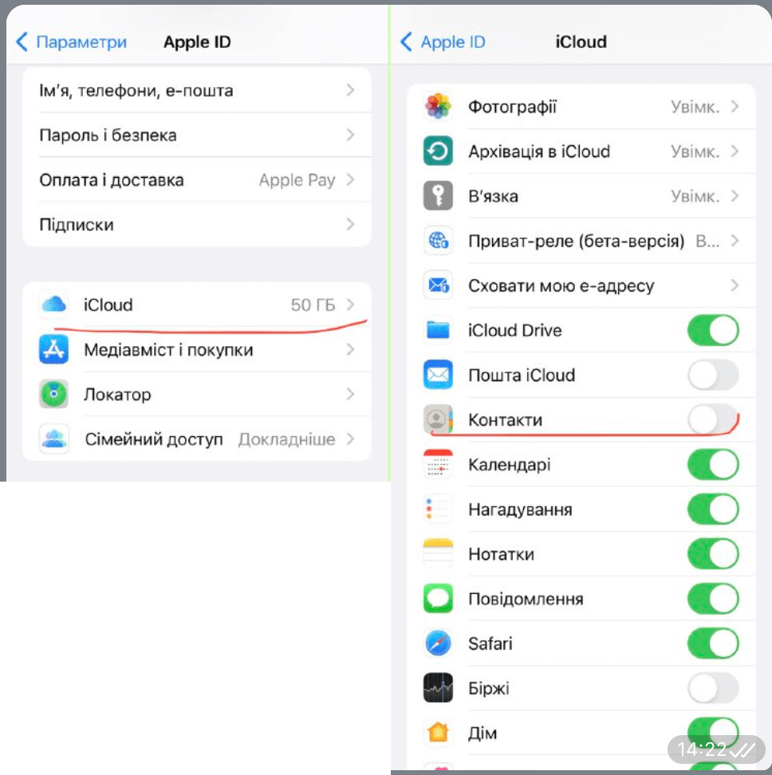
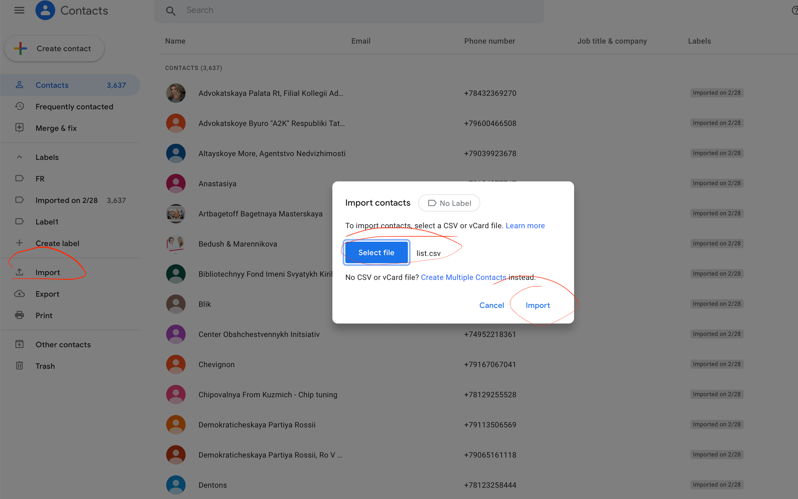
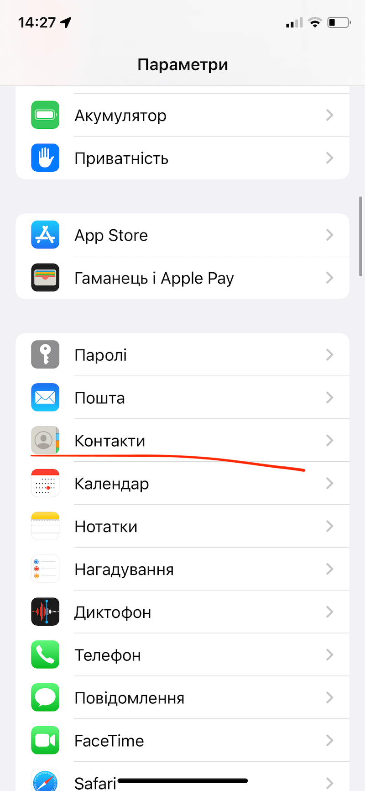
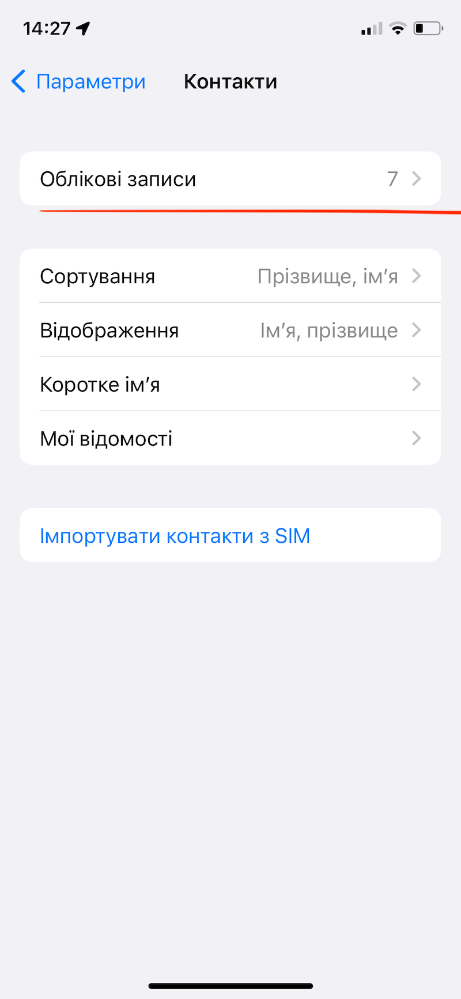
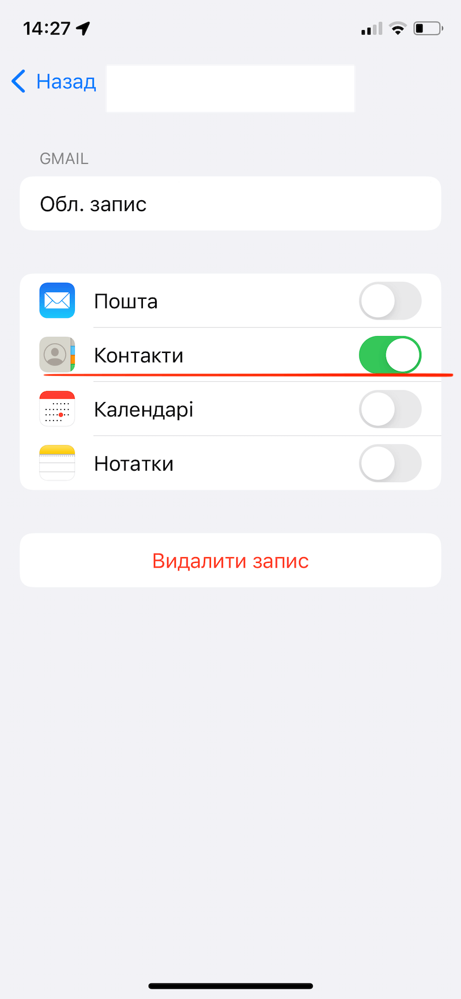
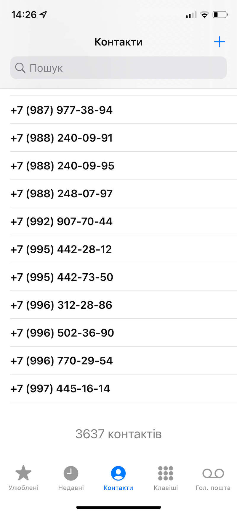

#### About
Script for sending whatsapp via selenium 🇺🇦

#### Prerequirements
- Whatsapp account (can bye lifecell esim)
- Python3
- Venv

#### Installation
1. Contact import to whatsapp 
- Remove icloud contacts from phone (in order to keep personal data safe)


- Verify that no personal contacts available in phone
- Import `list_all_for_import.csv` to google contacts as csv. (it may take a while)

- Then add google account to iPhone contacts



- Verify that no personal contacts available in phone
 
- Login to whatsapp and sync contacts (it may take a while)

2. Clone repo to local
```
git clone https://github.com/fuckputin01/fuck_putin_whatsapp
or download zip from github
```

3. Install python venv
```
python3 -m venv /virtual/environment
source /virtual/environment/bin/activate
pip install -r requirements.txt
```

3.5  (optional) Update text in `main.py`
```
text = "Остановите Путина! Выходите на протест! Сохраните себя, страну и свою армию!"
```

3.7 ATTENTION: in case of wrong phone number, there is a popup in whatsapp.
If whatsapp language is not Ukrainian need to change `main.py`:
```
if 'неправильний' in driver.page_source:
```
change `неправильний` to whatever available at phone not available popup.
4. run `main.py`
```
python main.py
```

5. After login using QR in Google Chrome, press enter in terminal

6. Enjoy

### TODO
1. Add centralized DB for phones
2. Add more details to this README
3. Clean up the repo
4. Win the war and fuck off putin. 🇺🇦
